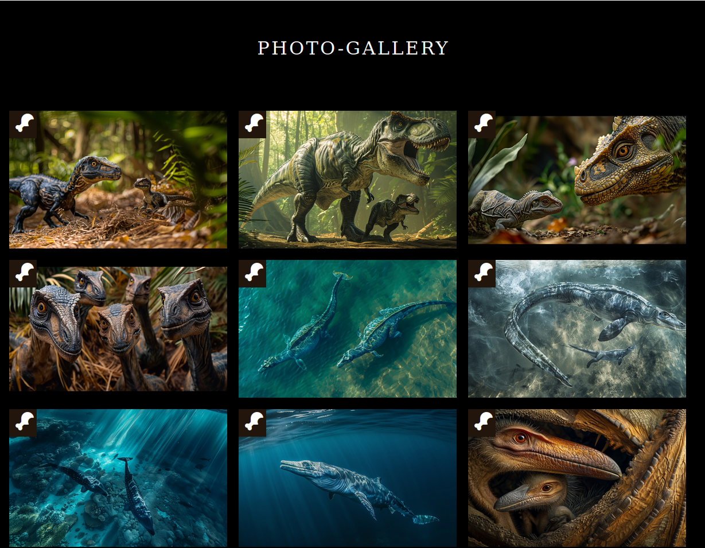
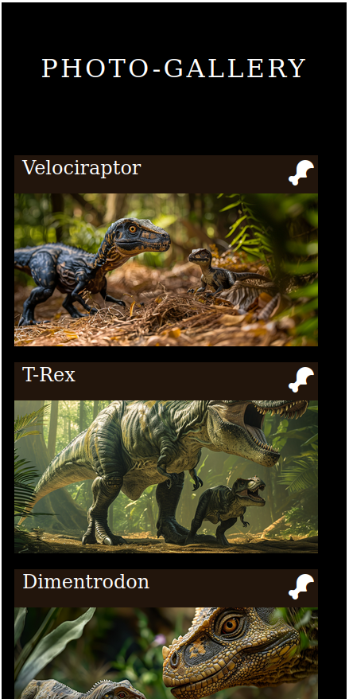

# Photo Gallery Projekt

Dies ist ein einfaches Projekt für eine Foto-Galerie, das mit HTML und CSS erstellt wurde.

## Beschreibung

Das Projekt zeigt eine Galerie von Dinosaurier-Fotos. Jede Karte in der Galerie enthält ein Bild eines Dinosauriers mit seinem Namen.

## Vorschau

- Bildschirm Ansicht der Seite:

- Mobile Ansicht der Seite:

## Funktionen

- Reaktionsschnelle Anordnung: Die Galerie passt sich der Bildschirmgröße an und sieht auf verschiedenen Geräten gut aus.
- Hover-Effekt: Wenn du mit der Maus über ein Bild fährst, wird das Bild vergrößert und vollständig angezeigt.

## Setup

1. Klonen Sie das Repository auf Ihren lokalen Computer:

git clone git@github.com:Malouzi/Photo-Gallery-Project.git

2. Öffnen Sie die `index.html`-Datei in einem Webbrowser, um die Foto-Galerie anzuzeigen.

## Mitwirkende

- Marie-Louise Zirzlaff: Entwickler

## Lizenz

Dieses Projekt ist unter der [MIT-Lizenz](LICENSE) lizenziert.